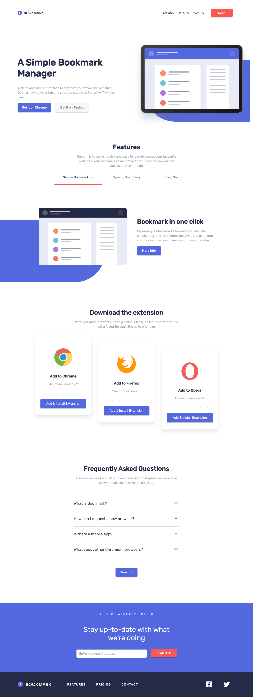
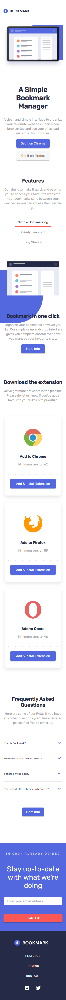
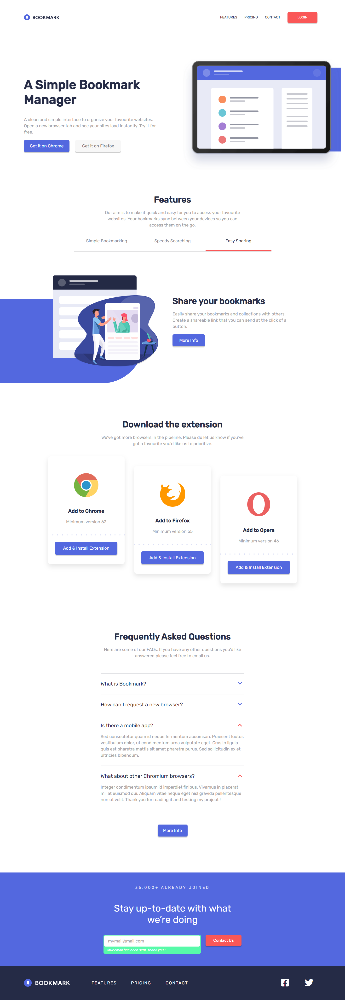
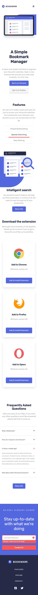

# Frontend Mentor - Bookmark landing page solution

### The challenge

Users should be able to:

- View the optimal layout for the site depending on their device's screen size
- See hover states for all interactive elements on the page
- Receive an error message when the newsletter form is submitted if:
  - The input field is empty
  - The email address is not formatted correctly

### Screenshot

Computer view

Mobile view

Computer active states

Mobile active states

Mobile menu

### Built with

- HTML5
- CSS
- Javascript
- Flexbox

### What I learned

One of the funniest challenges so far.
Nothing really hard but there was a lot of stuff to do and some were quite challenging.

I had never done a slider like this before, I'm proud I made it without looking for any inspiration or help on the internet.
